Las plataformas como servicio o (PaaS) son un conjunto de servicios/aplicaciones basados en la nube que permite disponer de una capacidad de cálculo y almacenamiento (aparentemente) ilimitada. Obviamente el uso de dichos recursos suele tener un coste asociado y, a pesar de que el desarrollador puede centrarse en la lógica de negocio, alguien debe asumir el rol de economista y plantear límites ;)

Una de las ventajas de la virtualización y de la tecnología de contenedores es que el equipo de desarrollo puede trabajar en el mismo entorno exacto en el que se ejecutará la aplicación en producción. Es obvia la ganancia en tiempo a la hora de realizar un despliegue.

Los contenedores son una tecnología que ofrece unas ventajas similares a las máquinas virtuales pero optimizando el uso de recursos. Los contenedores tienen un tiempo de arranque reducido con respecto a una máquina convencional y, además, la memoria que necesita la app ejecutada en el contenedor se ajusta sobre el proceso, en una MV se reserva la memoria completa.

**Azure** es el PaaS de Microsoft, también conocido como la nube hablando en términos coloquiales. Permite el acceso bajo demanda a múltiples recursos computacionales: almacenamiento, servidores, aplicaciones, servicios. Realmente, Azure es SaaS, IaaS y PaaS aunque se considera de forma primaria un PaaS. La gestión necesaria on-premise se aleja del usuario en tanto que el proveedor aloja el hardware y el software en su propia infraestructura y ofrece una solución integrada. En la siguiente imagen, tomada de la web de [Red Hat](https://www.redhat.com/es/topics/cloud-computing/iaas-vs-paas-vs-saas) se pueden apreciar las principales diferencias entre las `-aas` y las soluciones desplegadas en cliente. 


De acuerdo con [Microsoft](https://azure.microsoft.com/en-us/overview/what-is-saas/) en la siguiente imagen se pueden ver las diferencias entre las `-aas` en función de los requisitos hardware y software necesarios.

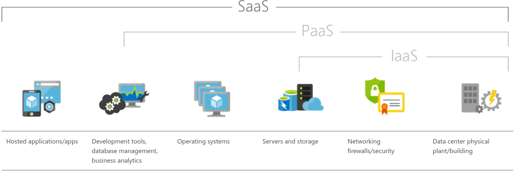

Las tres proporcionan soluciones escalables que siguen el modelo de paga-por-lo-que-uses. La realidad es que un PaaS ofrece lo mismo que un SaaS excepto por la propia aplicación, que es el propio desarrollador el que debe mantenerla. Basicamente, a este nivel, los desarrolladores pueden desplegar y desarrollar aplicaciones sin consumo de recursos en la máquina local. Ejemplos, además de Azure pueden ser *Heroku* y *Google App Engine*.

Para comprender qué es Azure y por qué es interesante utilizarlo, vamos a plantear un ejemplo de integración con `Docker`. La idea detrás de Docker es la de utilizar contenedores portables que consumen pocos recursos para encapsular diferentes aplicaciones software que, además, puedan ejecutarse en cualquier máquina que tenga `Docker` instalado. Incluso en una nube como *Azure*. Es decir, independientemente de lo que esté corriendo por debajo en cuanto a sistema operativo o tipo de hardware de la máquina, el despliegue se llevará a cabo. Un contenedor no deja de ser algo que funciona por sí mismo, es autocontenido y que se puede llevar a cualquier parte pues funciona independientemente del soporte y es portable.

`Docker` necesita que dentro del contenedor esté todo aquello que la aplicación va a necesitar (o al menos que le indiques dónde debe ir a buscarlo y enlazarlo). Una gran ventaja es que se encierran en el contenedor las dificultades de instalación, las dependencias y demás quebraderos de cabeza y se deben sufrir una única vez! por supuesto los típicos problemas de actualización de una librería concreta con incompatibilidades o de una dependencia en una versión concreta que se pierde, desaparecen. Por si fuera poco, existe un repositorio público gratutito en la nube de las imágenes que se generan llamado [DockerHub](https://hub.docker.com/) y se fundamenta todo sobre un sistema de versionado! Entrar en problemas de conflictos o de pérdida de funcionalidad por cambio de versión es casi imposible!

Una `Docker image` es una plantilla básica de un contenedor que contiene el sistemas operativo, las librerías y la aplicación. Un contenedor se arranca a partir de una imagen y, como hemos dicho, las podemos generar y descargar después desde [DockerHub](https://hub.docker.com/), que está gestionado por `Docker`.

El `Docker registry` es el servicio remoto que se utiliza para almacenar y recuperar las imágenes (con todas las versiones que se hayan subido). Se puede pagar por repositorios privados o incluso montar un repositorio propio de imágenes.

Como se ha dicho anteriormente, un `Docker container` es el equivalente a una máquina virtual y se crea a partir de una imagen. Es posible parar, pausar o parar los contenedores y las operaciones de escritura de un fichero por ejemplo, no afectan a la imagen, afectan al contenedor.

Para la gestión de los contenedores (arranque, parada, pausa, etc.) se utiliza el `Docker engine`, que permite además la gestión de las imágenes (descarga, creación, actualización, publicación, etc.). Lo más habitual es instalar el servicio en local para controlar `Docker` aunque se puede gestionar vía API REST.

Por último, el `Docker client` es un interfaz de línea de comandos (CLI) que se utiliza para controlar el `Docker engine`.

Para poder llevar a cabo el ejemplo es necesario disponer de un entorno de desarrollo/despliegue configurado adecuadamente para `Azure` y `Docker`. Se irán viendo a continuación los pasos necesarios y se dará, además, un pequeño tutorial de introducción a ambas tecnologías.

# Configuración del entorno

A continuación se mostrarán un conjunto mínimo de pasos necesarios para configurar `Docker` y ser capaces de descargar imágenes ya creadas o generar las nuestras propias a partir de un Dockerfile y subirlas al repositorio. Se muestra sobre una máquina con Ubuntu 18.04 pero sería equivalente en máquinas con otros SO instalados sobre los que pueda correr Docker, más información en los enlaces de la sección siguiente.

## Pasos previos

1. Cread una cuenta en DockerHub. [enlace](https://hub.docker.com/signup).

2. Instalad (cada uno que decida el SO que va a utilizar) el motor docker en vuestras máquinas [enlace](https://docs.docker.com/install/)

3. Instalad un cliente `Git` en vuestras máquinas

4. Vamos a desplegar la primera aplicación *dockerizada* siguiendo los siguientes pasos

## Hola Mundo en Docker

Para verificar que la instalación es correcta y que todo está funcionando adecuadamente, se clona una aplicación desde GitHub (se podrían descargar desde el propio DockerHub)

```{bash eval=F}
cfernandez:~>mkdir ics-master
cfernandez :~>cd ics-master
cfernandez :~/ics-master> git clone -b v1 https://github.com/docker-training/node-bulletin-board
Cloning into 'node-bulletin-board'...
remote: Enumerating objects: 190, done.
remote: Total 190 (delta 0), reused 0 (delta 0), pack-reused 190
Receiving objects: 100% (190/190), 194.43 KiB | 1.28 MiB/s, done.
Resolving deltas: 100% (82/82), done.
cfernandez:~/ics-master/>cd node-bulletin-board/bulletin-board-app
cfernandez:~/ics-master/node-bulletin-board/bulletin-board-app/>ls
app.js   Dockerfile  index.html  package.json  server.js
backend  fonts       LICENSE     readme.md     site.css
```

Mostrad el contenido del fichero *Dockerfile*

```{bash eval=F}
cfernandez:~/ics-master/node-bulletin-board/bulletin-board-app> cat Dockerfile 
FROM node:6.11.5

WORKDIR /usr/src/app
COPY package.json .
RUN npm install
COPY . .

CMD [ "npm", "start" ]

```

el contenido del fichero `package.json` es el siguiente:

```{bash eval=F}
cfernandez:~/ics-master/node-bulletin-board/bulletin-board-app>cat package.json 
{
  "name": "vue-event-bulletin",
  "version": "1.0.0",
  "description": "Demo application for the scotch.io tutorial",
  "main": "server.js",
  "author": "Ryan Chenkie, Jason Lam",
  "license": "MIT",
  "dependencies": {
    "bootstrap": "^3.3.6",
    "ejs": "^2.3.4",
    "express": "^4.13.3",
    "morgan": "^1.6.1",
    "vue": "^1.0.10",
    "vue-resource": "^0.1.17"
  },
  "devDependencies": {
    "body-parser": "^1.14.1",
    "errorhandler": "^1.4.2",
    "method-override": "^2.3.5",
    "morgan": "^1.6.1"
  }
}

```

Se trata de una aplicación DEMO con licencia MIT de Node.js. Se explicarán más adelante las instrucciones del `Dockerfile` (palabras clave en mayúsculas).

Un *Dockerfile* es un fichero de texto donde se indican los diferentes comandos que se quieren ejecutar sobre una imagen base de partida. Es el punto de partida que leerá el comando `$ docker build` para poder construir la imagen a partir de las instrucciones y la información de entorno que encuentre en el fichero.

Más adelante se verán buenas prácticas a la hora de crear un Dockerfile.

En el ejemplo anterior se parte de una imagen de Node.js en su versión 6.11.5 disponible en `DockerHub`.

# Docker

Construye y prueba tu primera imagen Docker para comprobar que la instalación es correcta.

## Docker service

Verifica que el demonio de docker está corriendo en el sistema y que no haya ningún problema:

```{bash eval=F}
cfernandez:~>systemctl status docker
docker.service - Docker Application Container Engine
   Loaded: loaded (/lib/systemd/system/docker.service; enabled; vendor preset: e
   Active: active (running) since Mon 2019-11-04 11:38:16 CET; 56min ago
     Docs: https://docs.docker.com
 Main PID: 29858 (dockerd)
    Tasks: 16
   CGroup: /system.slice/docker.service
           └─29858 /usr/bin/dockerd -H fd:// --containerd=/run/containerd/contai

nov 04 11:38:16 xps-13-9360 dockerd[29858]: time="2019-11-04T11:38:16.259692397+
nov 04 11:38:16 xps-13-9360 systemd[1]: Started Docker Application Container Eng
nov 04 11:38:16 xps-13-9360 dockerd[29858]: time="2019-11-04T11:38:16.329498966+
nov 04 11:42:48 xps-13-9360 dockerd[29858]: time="2019-11-04T11:42:48.647115178+
nov 04 11:42:48 xps-13-9360 dockerd[29858]: time="2019-11-04T11:42:48.797315839+
nov 04 12:12:12 xps-13-9360 dockerd[29858]: time="2019-11-04T12:12:12.683677771+
nov 04 12:12:12 xps-13-9360 dockerd[29858]: time="2019-11-04T12:12:12.878200640+
nov 04 12:12:14 xps-13-9360 dockerd[29858]: time="2019-11-04T12:12:14.061923062+
nov 04 12:21:43 xps-13-9360 dockerd[29858]: time="2019-11-04T12:21:43.555673900+
nov 04 12:21:43 xps-13-9360 dockerd[29858]: time="2019-11-04T12:21:43.758197196+
```

## Docker image build

Genera la imagen del proyecto que acabas de descargar. Para ello debes ejecutar el comando `$docker image build`.

```{bash eval=F}
cfernandez:~/ics-master/node-bulletin-board/bulletin-board-app>docker image build -t bulletinboard:1.0 .
Sending build context to Docker daemon  45.57kB
Step 1/6 : FROM node:6.11.5
6.11.5: Pulling from library/node
85b1f47fba49: Pull complete 
ba6bd283713a: Pull complete 
817c8cd48a09: Pull complete 
47cc0ed96dc3: Pull complete 
8888adcbd08b: Pull complete 
6f2de60646b9: Pull complete 
1666693bf996: Pull complete 
2fe410df7942: Pull complete 
Digest: sha256:fe109b92edafd9821fbc1c80fd7587a1b4e1ff76fec3af675869e23e50bbf45b
Status: Downloaded newer image for node:6.11.5
 ---> 852391892b9f
Step 2/6 : WORKDIR /usr/src/app
 ---> Running in e6231cc7fd75
Removing intermediate container e6231cc7fd75
 ---> 5545981ede36
Step 3/6 : COPY package.json .
 ---> 5b4753141cde
Step 4/6 : RUN npm install
 ---> Running in b97ada7582d6
vue-event-bulletin@1.0.0 /usr/src/app
+-- body-parser@1.19.0 
| +-- bytes@3.1.0 
| +-- content-type@1.0.4 
| +-- debug@2.6.9 
| | `-- ms@2.0.0 
| +-- depd@1.1.2 
| +-- http-errors@1.7.2 
| | +-- inherits@2.0.3 
| | `-- toidentifier@1.0.0 
| +-- iconv-lite@0.4.24 
| | `-- safer-buffer@2.1.2 
| +-- on-finished@2.3.0 
| | `-- ee-first@1.1.1 
| +-- qs@6.7.0 
| +-- raw-body@2.4.0 
| | `-- unpipe@1.0.0 
| `-- type-is@1.6.18 
|   +-- media-typer@0.3.0 
|   `-- mime-types@2.1.24 
|     `-- mime-db@1.40.0 
+-- bootstrap@3.4.1 
+-- ejs@2.7.1 
+-- errorhandler@1.5.1 
| +-- accepts@1.3.7 
| | `-- negotiator@0.6.2 
| `-- escape-html@1.0.3 
+-- express@4.17.1 
| +-- array-flatten@1.1.1 
| +-- content-disposition@0.5.3 
| +-- cookie@0.4.0 
| +-- cookie-signature@1.0.6 
| +-- encodeurl@1.0.2 
| +-- etag@1.8.1 
| +-- finalhandler@1.1.2 
| +-- fresh@0.5.2 
| +-- merge-descriptors@1.0.1 
| +-- methods@1.1.2 
| +-- parseurl@1.3.3 
| +-- path-to-regexp@0.1.7 
| +-- proxy-addr@2.0.5 
| | +-- forwarded@0.1.2 
| | `-- ipaddr.js@1.9.0 
| +-- range-parser@1.2.1 
| +-- safe-buffer@5.1.2 
| +-- send@0.17.1 
| | +-- destroy@1.0.4 
| | +-- mime@1.6.0 
| | `-- ms@2.1.1 
| +-- serve-static@1.14.1 
| +-- setprototypeof@1.1.1 
| +-- statuses@1.5.0 
| +-- utils-merge@1.0.1 
| `-- vary@1.1.2 
+-- method-override@2.3.10 
+-- morgan@1.9.1 
| +-- basic-auth@2.0.1 
| `-- on-headers@1.0.2 
+-- vue@1.0.28 
| `-- envify@3.4.1 
|   +-- jstransform@11.0.3 
|   | +-- base62@1.2.8 
|   | +-- commoner@0.10.8 
|   | | +-- commander@2.20.3 
|   | | +-- detective@4.7.1 
|   | | | +-- acorn@5.7.3 
|   | | | `-- defined@1.0.0 
|   | | +-- glob@5.0.15 
|   | | | +-- inflight@1.0.6 
|   | | | | `-- wrappy@1.0.2 
|   | | | +-- minimatch@3.0.4 
|   | | | | `-- brace-expansion@1.1.11 
|   | | | |   +-- balanced-match@1.0.0 
|   | | | |   `-- concat-map@0.0.1 
|   | | | +-- once@1.4.0 
|   | | | `-- path-is-absolute@1.0.1 
|   | | +-- graceful-fs@4.2.3 
|   | | +-- mkdirp@0.5.1 
|   | | | `-- minimist@0.0.8 
|   | | +-- private@0.1.8 
|   | | +-- q@1.5.1 
|   | | `-- recast@0.11.23 
|   | |   +-- ast-types@0.9.6 
|   | |   +-- esprima@3.1.3 
|   | |   `-- source-map@0.5.7 
|   | +-- esprima-fb@15001.1.0-dev-harmony-fb 
|   | +-- object-assign@2.1.1 
|   | `-- source-map@0.4.4 
|   |   `-- amdefine@1.0.1 
|   `-- through@2.3.8 
`-- vue-resource@0.1.17 

npm WARN vue-event-bulletin@1.0.0 No repository field.
Removing intermediate container b97ada7582d6
 ---> ddf9c0a82711
Step 5/6 : COPY . .
 ---> 0756607407a1
Step 6/6 : CMD [ "npm", "start" ]
 ---> Running in e3e26d80b9d0
Removing intermediate container e3e26d80b9d0
 ---> 2cfc10259620
Successfully built 2cfc10259620
Successfully tagged bulletinboard:1.0

```

Luego se hablará de ello pero fíjate que la generación de la imagen ha requerido 6 pasos. Tras la correcta finalización de cada uno de ellos, aparece un código, por ejemplo en el paso 6 de 6 nos encontramos con e3e26d80b9d0 es el id de la capa.

## Docker container run

Inicializa el contenedor con la nueva imagen. Para ello debes ejecutar el comando `$docker container run`. En este caso fíjate que se publica en el puerto 8000 de la máquina local y que se enlaza con el 8080 del contenedor.

```{bash eval=F}
cfernandez:~/ics-master/node-bulletin-board/bulletin-board-app>docker container run --publish 8000:8080 --detach --name bb bulletinboard:1.0
e70e42aadc1b851d610bbcc79f928516ab9b5a6755b5dc54d459c993db2356a4

```

Se indica que ejecute el contenedor en segundo plano `--detach`, con un nombre determinado `--name` que en este caso es bb y, se solicita que se genere a partir de la imagen llamada bulletingboard en su version 1.0 con `bulletinboard:1.0`.

Abre un navegador web con la siguiente dirección [localhost:8000](localhost:8000) y comprueba qué es lo que aparece, debería ser como lo que aparece en la siguiente imagen:

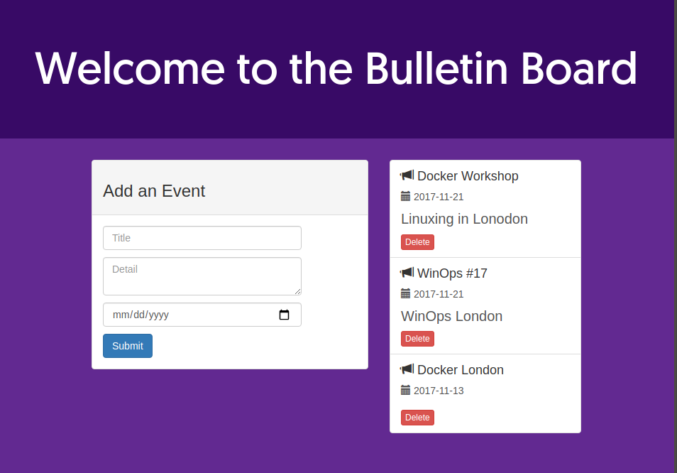

## Docker ps

Lista los contenedores Docker corriendo en el sistema y elimina el que acabas de crear. Para listar contenedores activos se utiliza el comando `docker ps`.

```{bash eval=F}
cfernandez:~/ics-master/node-bulletin-board/bulletin-board-app>docker ps
CONTAINER ID        IMAGE               COMMAND             CREATED             STATUS              PORTS                    NAMES
e70e42aadc1b        bulletinboard:1.0   "npm start"         3 minutes ago       Up 3 minutes        0.0.0.0:8000->8080/tcp   bb

```

Para liminar un contenedor activo que está corriendo, sin pararlo, se debe utilizar el comando `$docker container rm --force` y dar el nombre del contenedor, en este caso bb o los primeros dígitos del CONTAINER ID de la siguiente forma. En caso de tratar de eliminar un contenedor que está corriendo nos dará un error:

```{bash eval=F}
cfernandez:~/ics-master/node-bulletin-board/bulletin-board-app>docker container rm --force bb
bb

```

## Docker images

Es posible listar las imágenes de aplicaciones generadas con el comando `$docker images`.

```{bash eval=F}
cfernandez:~/ics-master/node-bulletin-board/bulletin-board-app>docker images
REPOSITORY          TAG                 IMAGE ID            CREATED             SIZE
bulletinboard       1.0                 2cfc10259620        10 minutes ago      681MB
hello-world         latest              fce289e99eb9        10 months ago       1.84kB
node                6.11.5              852391892b9f        24 months ago       662MB
```

## Docker rmi

Así como eliminar imágenes del sistema con el comando `$docker rmi`.

```{bash eval=F}
cfernandez:~/ics-master/node-bulletin-board/bulletin-board-app>docker rmi 2cfc10259620
Untagged: bulletinboard:1.0
Deleted: sha256:2cfc1025962090cd26fe03f9b6e1effe6deea48dcba59239dbbc80bcec5e7864
Deleted: sha256:0756607407a1155bcb0a4cb4d096ccbec4cc94b5b3f73d744c63c05a777a65c4
Deleted: sha256:8f61dffcd6c523aa46e0280f45d426ff5c037078eb72c0e0da308ec231fd08fc
Deleted: sha256:ddf9c0a827117a77d02316a41869de8eb98fd57d904d0de3d6dbecba0e30dbf2
Deleted: sha256:e45dc1a3fb220748ddebd5d9b045a5e35316f97d538703469b7fb85bca93da5d
Deleted: sha256:5b4753141cdeeb33968b92dd57b6be391718b7197b82c95d730e0a569ac211e6
Deleted: sha256:f07db67280626ab53828324c6631e733ec7d12e537aeacb415734b3c03b546ff
Deleted: sha256:5545981ede3653c3c8cb07a67d279fe40d9d290ab588798d58343ef12164edaa
Deleted: sha256:bb9d9d04eaa98ca064f89f1da2ba23edd8cfacf634d5d999e513b02d60a2cc62

```

es posible que para alguna imagen sea necesario forzar la eliminación de la imagen.

```{bash eval=F}
cfernandez:~/ics-master/node-bulletin-board/bulletin-board-app>docker rmi -f fce289e99eb9
Untagged: hello-world:latest
Untagged: hello-world@sha256:c3b4ada4687bbaa170745b3e4dd8ac3f194ca95b2d0518b417fb47e5879d9b5f
Deleted: sha256:fce289e99eb9bca977dae136fbe2a82b6b7d4c372474c9235adc1741675f587e
```

## Docker search

Se puede realizar una búsqueda de las imágenes disponibles en Dockerhub por línea de comandos sin necesidad de acceder a la web. Por ejemplo para el sistema operativo Centos con el comando `$docker search centos`. Nos devolverá todas aquellas imágenes públicas de DockerHub que aparezcan en la búsqueda por la palabra clave indicando además si es la imagen oficial y el número de votos positivos o estrellas que otros usuarios le han dado. Además de una muy breve descripción de la imagen.

```{bash eval=F}
cfernandez :~>docker search centos
NAME                               DESCRIPTION                                     STARS               OFFICIAL            AUTOMATED
centos                             The official build of CentOS.                   5648                [OK]                
ansible/centos7-ansible            Ansible on Centos7                              125                                     [OK]
jdeathe/centos-ssh                 OpenSSH / Supervisor / EPEL/IUS/SCL Repos - …   114                                     [OK]
consol/centos-xfce-vnc             Centos container with "headless" VNC session…   100                                     [OK]
centos/mysql-57-centos7            MySQL 5.7 SQL database server                   64                                      
imagine10255/centos6-lnmp-php56    centos6-lnmp-php56                              57                                      [OK]
tutum/centos                       Simple CentOS docker image with SSH access      44                                      
centos/postgresql-96-centos7       PostgreSQL is an advanced Object-Relational …   39                                      
kinogmt/centos-ssh                 CentOS with SSH                                 29                                      [OK]
pivotaldata/centos-gpdb-dev        CentOS image for GPDB development. Tag names…   10                                      
nathonfowlie/centos-jre            Latest CentOS image with the JRE pre-install…   8                                       [OK]
drecom/centos-ruby                 centos ruby                                     6                                       [OK]
centos/tools                       Docker image that has systems administration…   4                                       [OK]
darksheer/centos                   Base Centos Image -- Updated hourly             3                                       [OK]
mamohr/centos-java                 Oracle Java 8 Docker image based on Centos 7    3                                       [OK]
pivotaldata/centos                 Base centos, freshened up a little with a Do…   3                                       
pivotaldata/centos-mingw           Using the mingw toolchain to cross-compile t…   2                                       
miko2u/centos6                     CentOS6 日本語環境                                   2                                       [OK]
pivotaldata/centos-gcc-toolchain   CentOS with a toolchain, but unaffiliated wi…   2                                       
mcnaughton/centos-base             centos base image                               1                                       [OK]
indigo/centos-maven                Vanilla CentOS 7 with Oracle Java Developmen…   1                                       [OK]
blacklabelops/centos               CentOS Base Image! Built and Updates Daily!     1                                       [OK]
pivotaldata/centos6.8-dev          CentosOS 6.8 image for GPDB development         0                                       
pivotaldata/centos7-dev            CentosOS 7 image for GPDB development           0                                       
smartentry/centos                  centos with smartentry                          0                                       [OK]
```

## Docker image pull

Para descargar una de las posibles imágenes se debe usar el comando `$docker image pull` seguido del nombre de la imagen. No es obligatorio pero es habitual que las imágenes generadas por el usuario lleven indicado de alguna manera el usuario o la imagen de partida base más el nombre de la imagen final, habitualmente separado por `/`. Algunas aprovechan a poner la versión de la imagen base por ejemplo `centos/mysql-57-centos7` nos indica que el usuario centos ha montado un mysql version 5.7 sobre un centos versión 7. El tag por defecto es `latest`. En caso de que un usuario suba una imagen y no ponga versión es la que pondrá por defecto. Es más correcto versionar siempre las imágenes porque el `latest` de hoy, no tiene por qué ser el de mañana y puede llevar a confusiones.

```{bash eval=F}
cfernandez:~>docker image pull kinogmt/centos-ssh
Using default tag: latest
latest: Pulling from kinogmt/centos-ssh
Image docker.io/kinogmt/centos-ssh:latest uses outdated schema1 manifest format. Please upgrade to a schema2 image for better future compatibility. More information at https://docs.docker.com/registry/spec/deprecated-schema-v1/
a3ed95caeb02: Pull complete 
3b231ed5aa2f: Pull complete 
b73faae918f1: Pull complete 
2f96ec4f912b: Pull complete 
50ad9044db90: Pull complete 
ba40dad95ca2: Pull complete 
1d7a70b1b1da: Pull complete 
365930eae884: Pull complete 
7568f1af3835: Pull complete 
Digest: sha256:acdf7798259f859a8e713f2f88511eef5e0f94cb2d2dec078a1fe169a8aacf63
Status: Downloaded newer image for kinogmt/centos-ssh:latest
docker.io/kinogmt/centos-ssh:latest
```

## Docker container run -it

Es posible arrancar una máquina y acceder a ella de forma interactiva. Es muy útil, sobre todo al principio para chequear que todo está bien o buscar determinados ficheros y rutas. Para ello es necesario lanzar el comando `$docker container run -it`. En este caso se añade el nombre de la imagen y se le indica el comando que la imagen debe ejecutar que es `$/bin/bash` para que levante una shell.

```{bash eval=F}
cfernandez:~>docker container run -it kinogmt/centos-ssh /bin/bash
[root@c1576d0b4968 /]# rpm -q centos-release
centos-release-6-7.el6.centos.12.3.x86_64
[root@c1576d0b4968 /]# 
```

## Docker logs

En ocasiones es necesario revisar los logs de la máquina. Es cierto que `Docker` puede ser poco informativo en alguna ocasión y se trata de una de ellas. Podemos lanzar un comando para ejecutar un contenedor y ver que éste se cae sin motivo aparente. Para consultar los logs se puede utilizar el comando `$docker logs` seguido del CONTAINER ID. Por ejemplo, la salida de log del contenedor del ejemplo de bulletinboard es la siguiente:

```{bash eval=F}
cfernandez:~ics-master/node-bulletin-board/bulletin-board-app>docker logs d343

> vue-event-bulletin@1.0.0 start /usr/src/app
> node server.js

Magic happens on port 8080...
```


## Limpieza del sistema

Una vez se han llevado a cabo tareas con `Docker` y dependiendo de la capacidad del disco duro del equipo sobre el que se trabaja no es extraño que notemos un uso elevado del disco duro. Es recomendable no tener todas las imágenes posibles sino únicamente aquellas que necesitamos como base de las finales o, directamente, las imágenes finales con las que se está trabajando. Normalmente la forma más habitual de trabajar es generar una imagen base pesada con todos los recursos necesarios y montar una segunda imagen que parte de ella y lleva la configuración específcia del entorno. Esto es así porque se espera que la imagen base no cambie nada (o poco) a lo largo del ciclo de vida del desarrollo de la aplicación y sin embargo, la imagen que contiene la propia aplicación sí. Si se parte de sistemas complejos/pesados o con muchas dependencias se evita que los tiempos de generación de la imagen sean eternos aunque, algunas veces, se deben sufrir porque aparecen nuevas dependencias no contempladas. En este caso en el equipo hay una imagen que ocupa 773MB, podemos verlo con el comando `$docker image ls`.

```{bash eval=F}
cfernandez:~/dics-master>docker image ls
REPOSITORY           TAG                 IMAGE ID            CREATED             SIZE
kinogmt/centos-ssh   latest              dc8713dad282        3 years ago         773MB

```

Se pueden listar contenedores activos e inactivos y eliminarlos.

```{bash eval=F}
cfernandez:~/ics-master>docker container ps
CONTAINER ID        IMAGE               COMMAND             CREATED             STATUS              PORTS               NAMES
cfernandez:~/ics-master>docker container ls -a
CONTAINER ID        IMAGE                COMMAND             CREATED             STATUS                      PORTS               NAMES
c1576d0b4968        kinogmt/centos-ssh   "/bin/bash"         9 minutes ago       Exited (0) 8 minutes ago                        hungry_ptolemy
83a2fea9e1b0        kinogmt/centos-ssh   "/bin/bash"         12 minutes ago      Exited (0) 9 minutes ago                        nervous_lederberg
c965a44e0e12        kinogmt/centos-ssh   "/bin/bash"         12 minutes ago      Exited (0) 12 minutes ago                       relaxed_sinoussi
cc66c4be321a        fce289e99eb9         "/hello"            8 hours ago         Exited (0) 8 hours ago                          nostalgic_goldberg

```

para eliminar los contenedores bastaría con indicar al comando `$docker container rm` los CONTAINER ID (completos o los primeros dígitos) de aquellos que se quieran eliminar:

```{bash eval=F}
cfernandez:~/ics-master>docker container rm c1576d0b4968 83a2fea9e1b0 c965a44e0e12 cc66c4be321a
c1576d0b4968
83a2fea9e1b0
c965a44e0e12
cc66c4be321a

```

se podría ser más directo y eliminar todos los contenedores parados de la máquina, más info en el [enlace](https://docs.docker.com/engine/reference/commandline/rm/):

```{bash eval=F}
cfernandez:~/ics-master>docker rm $(docker ps -a -q)
```

en caso de necesitas parar contenedores de la máquina de forma rápida se podría ejecutar de forma similar el comando`$docker stop $(docker ps -a -q)`.

para eliminar una imagen se debe utilizar el comando `$docker rmi` seguido del IMAGE ID de la imagen o, al menos, los primeros dígitos.

```{bash eval=F}
cfernandez:~/dics-master>docker image ls
REPOSITORY           TAG                 IMAGE ID            CREATED             SIZE
kinogmt/centos-ssh   latest              dc8713dad282        3 years ago         773MB

cfernandez:~/ics-master>docker rmi dc8713dad282
Untagged: kinogmt/centos-ssh:latest
Untagged: kinogmt/centos-ssh@sha256:acdf7798259f859a8e713f2f88511eef5e0f94cb2d2dec078a1fe169a8aacf63
Deleted: sha256:dc8713dad28219f7be85c1c7ab08fa858905d7b4f78bf4999e6cdcd36eae2377
Deleted: sha256:69fb5656f4ed0a7f021546ca7c5cf987110637407586f9fc45f9481b7aebf3ca
Deleted: sha256:4ef8c7ab69e2bac9031001c70dba7277dc7e9eadfe8b65cc1750b38ce3012a2b
Deleted: sha256:9389efd80ed7a3c1130602aa8c0fce06be78b8b13f2436352483ec12c2d33fc3
Deleted: sha256:69ed47c0046587473fb1520501cca07705cd4b1430e971d9f438dcdbacb68fa7
Deleted: sha256:44b4bda5288bf8d457950036db43fa4f0ee21d1393fedf6f825e93ddfa0b495c
Deleted: sha256:4df98bae5546cf893a372f58a140651a241e0bcd1af28111b0b2dc4eb91021a9
Deleted: sha256:7da59528e567882bf7d6bdf53f8ce1ed207fa1512f0ed1f6d245bd097fcbf260
Deleted: sha256:dad13f415d8417662f6a8c0790109106e05601d65651b7a8b4470fb434a83f97
Deleted: sha256:b5471e6ec524d0911384bddc342965d98f164844889e06db5f4976e56e74dbd1
Deleted: sha256:e7973ae3b5b17bb7d5a2acb9a90f52751df60e1ccdf2b85ca90b8640650684f9
Deleted: sha256:0856b2ee9c1a321ee71f5c19cb07aa0a07e11c28fa8f22d867d02a3c79080e36
Deleted: sha256:5f70bf18a086007016e948b04aed3b82103a36bea41755b6cddfaf10ace3c6ef

```

## Dockerfile
Alguna de las [buenas prácticas](https://takacsmark.com/dockerfile-tutorial-by-example-dockerfile-best-practices-2018/) que se considera a la hora de crear un fichero Dockerfile serían las siguientes:

* Debe mantenerse la configuración mínima necesaria en los contenedores, en otro caso puede que la creación, despliegue y parada de contenedores lleve un tiempo elevado de forma innecesaria.
* No instalar paquetes o dependencias innecesarios, dedicar un tiempo a estudiar los requisitos técnicos de la imagen que se va a generar.
* El funcionamiento del Dockerfile está jerarquizado en capas, debe buscarse siempre un equilibrio entre número de capas y legibilidad así como relación entre elementos de cada capa
* Utilizar de forma adecuada la `/` para organizar argumentos en múltiples líneas y permitir que el fichero sea lo más legible posible, por ejemplo para la instalación de librerías de uso general:

```{bash eval=F}
# Sección de instalación de ibrerias de uso general
RUN apt-get update && apt-get install -y --no-install-recommends \
	sudo \
	libcurl4-gnutls-dev \
	libcairo2-dev \
	libxt-dev \
	libssl-dev \
	libssh2-1-dev \
&& rm -rf /var/lib/apt/lists/*

```

A continuación se comentarán algunas de las instrucciones más habituales dentro un Dockerfile. Para obtener una información más detalle se recomienda visitar el siguiente [enlace](https://docs.docker.com/engine/reference/builder/) con la documentación oficial. Se mostrarán las instrucciones más habituales aunque existen otras.

### FROM

Indica la imagen de partida a partir de la cual se comenzará a crear la imagen. Lo primero que hará el motor de docker es ver si la imagen está en local, en caso contrario irá al repositorio de internet, como por ejemplo `dockerhub` y la descargará. Toda imagen debe tener un `nombre` y un `tag`, esto es una de las cosas que hace que Docker sea una herramienta de tanta utilidad, siempre será posible acceder a la máquina concreta, en su versión precisa para replicar un comportamiento.

Sintaxis:

```{bash eval=F}
FROM <nombre.imagen>
FROM <nombre.imagen>:<tag>
```

### WORKDIR

La instrucción `WORKDIR` fija el directorio de trabajo de cualquier instrucción `RUN`, `CMD`, `ENTRYPOINT`, `COPY` o `ADD` que vayan a continuación de ella en el fichero `Dockerfile`. Se puede utilizar múltiples veces y si se trata de paths relativos, lo serán al primer `WORKDIR` del fichero. Además, se puede usar de forma conjunta con variables de entorno definidas con `ENV`. Si el directorio no existiese, se crearía.

La sintaxis sería la siguiente:

```{bash eval=F}
ENV DIRPATH=/path
WORKDIR $DIRPATH/nombreDirectorio
```


### RUN

Es posible lanzar la ejecución de un comando sobre la capa anterior de tal forma que al finalizar se haga un commit y se genere una nueva capa. Este funcionamiento permite que, por ejemplo, si en nuestra generación de imagen con 5 capas previa se detecta un fallo o una librería que falta, cuando se construya la imagen de nuevo `docker` verifique los cambios y ejecute únicamente aquellas capas que hayan cambiado. Esto supone un ahorro en tiempo considerable. La instrucción `RUN` puede llevarse a cabo de dos formas: modo consola o modo ejecución.

**Modo consola**

La sintaxis sería como sigue:

```{bash eval=F}
RUN comando
```

**Modo ejecución**

La sintaxis sería como sigue:

```{bash eval=F}
RUN ["comando", "parámetro", "parámetro"]
```

### ENV

Se utiliza la instrucción `ENV` para configurar aquellas variables de entorno que se desee que estén disponibles para toda la secuencia de instrucciones del fichero.

La sintaxis sería como sigue:

```{bash eval=F}
ENV <key> <value>
ENV <key>=<value>
```

### ADD y COPY

Es posible copiar archivos o incluso directorios desde nuestra máquina al contenedor para tenerlos disponibles en la ruta especificada y que puedan ser utilizados por la imagen. Ambas instrucciones funcionan de manera similar aunque de forma general se prefiere COPY porque es más transparente que ADD. `COPY` funciona de manera intuitiva copiando ficheros del sistema local al contenedor mientras que `ADD` puede también trabajar sobre ficheros comprimidos o URLs.

La sintaxis sería como sigue:

```{bash eval=F}
COPY <origen> <destino>
```

### EXPOSE

La instrucción `EXPOSE` indica los puertos en los que el contenedor va a escuchar a la espera de conexiones entrantes. Lo más habitual es utilizar el mismo puerto que la aplicación original utilizaría al ser desplegada en un equipo de forma convencional, por ejemplo servidores web en el 80, aunque es posible indicar el puerto sin dicha restricción.

La sintaxis sería como sigue:

```{bash eval=F}
EXPOSE 22
```

### CMD y ENTRYPOINT

Ambas instrucciones permiten indicar qué ejecutable debe ser ejecutado cuando se inicia un contenedor. Algunas de las instrucciones anteriores pueden ponerse en el `Dockerfile` o de forma explícita en el comando `$ docker run`. En caso de no haberlo hecho así, la única manera de conseguir que la imagen sea ejecutable es con CMD o ENTRYPOINT.

Por ejemplo, las imágenes de ubuntu finalizan con `CMD ["/bin/bash"]` como se puede ver en el siguiente [enlace](https://github.com/tianon/docker-brew-ubuntu-core/blob/dist-amd64/xenial/Dockerfile).

Solamente puede existir una instrucción `CMD` en el Dockerfile, en caso de que existan más solamente la última será tenida en cuenta. El usuario podría interactuar con la imagen y el comando una vez comience a ejecutarse la máquina. En el caso de `ENTRYPOINT` el usuario no puede indicar otro comando cuando arranque le contenedor. Es decir, no se permite que el usuario ejecute otro comando que el esperado. 

Sin embargo, el uso de las instrucciones `CMD` y `ENTRYPOINT` o incluso, la combinación de ambas supera éste curso por lo que para una lectura más completa se recomienda seguir el siguiente [enlace](https://www.ctl.io/developers/blog/post/dockerfile-entrypoint-vs-cmd/).

La sintaxis base para ambas instrucciones sería:

```{bash eval=F}
CMD ["ejecutable", "parametro"]
ENTRYPOINT ["ejecutable", "parametro"]
```

También tiene formato ejecución y modo consola.

### VOLUME

En caso de querer exponer algún almacenamiento, ya sea un área de almacenamiento de bases de datos, una estructura de ficheros o una configuración de almacenamiento debe usarse la instrucción `VOLUME`. Para más información acerca de como compartir volúmenes usando la consola se puede consultar el siguiente [enlace](https://docs.docker.com/storage/volumes/).

La sintaxis sería la siguiente:

```{bash eval=F}
VOLUME ["/path/files", "/path/files"]
```

# Azure

Como se ha mencionado anteriormente Azure es el PaaS de Microsoft. A partir del ejemplo de bulletinboard visto al comienzo del curso se verán los pasos necesarios a llevar a cabo para desplegar un contenedor sobre Azure. 

## Alta en la cuenta de Azure

Lo primero que hay que hacer es darse de alta en Azure, para ello debéis visitar el siguiente [enlace](https://azure.microsoft.com/es-es/free/).

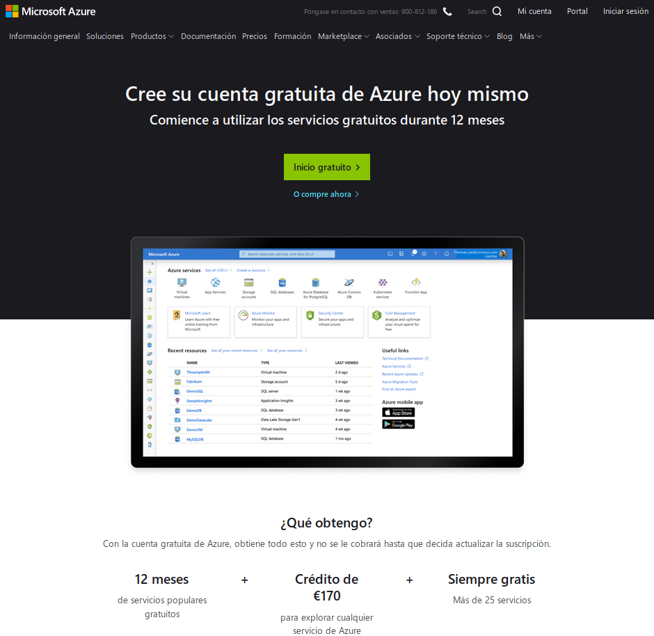

Como podéis ver, dispondréis de una crédito de 170€. Además, 12 meses de servicios populares gratuitos y siempre gratis, más de 25 servicios.

En mi caso, en la pantalla de Login, he creado una nueva cuenta.

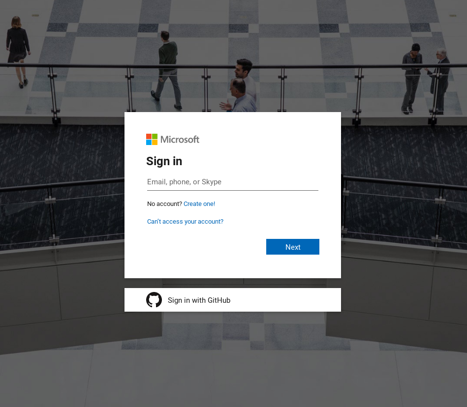

Pasaréis por el alta de nuevo usuario donde, de nuevo, os indicará los servicios/saldo de la cuenta gratuita.

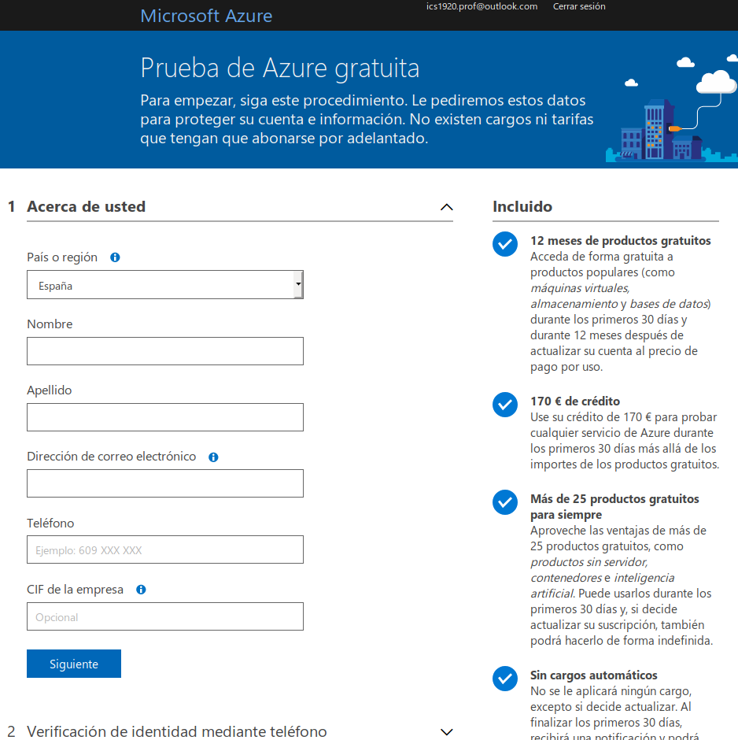

Si todo ha ido correctamente, pasaréis a la vista del panel con todos las posibilidades que ofrece Azure. Todos los pasos que veréis reflejados en el documento a continuación se pueden realizar tanto vía web como en consola. En este caso, se mostrarán únicamente los pasos a través de la consola.

## Instalación consola de azure en Ubuntu

Lo primero que hace falta es instalar la consola de Azure para Ubuntu. Microsoft ya tiene disponible un script completo de instalación para ejecutar como super-usuario.

```{bash eval=F}
curl -sL https://aka.ms/InstallAzureCLIDeb | sudo bash
```

En caso de problemas o que por algún motivo no se quiera ejecutar dicho script, se pueden consultar los pasos de instalación manual en el siguiente [enlace](https://docs.microsoft.com/en-us/cli/azure/install-azure-cli-apt?view=azure-cli-latest).

### Dependencia para despliegue de contenedores

Es necesario instalar [Helm](https://helm.sh/), para ello se debe descargar y ejecutar el siguiente script:

```{bash eval=F}
curl https://raw.githubusercontent.com/helm/helm/master/scripts/get-helm-3 | bash
```

el resultados es el mostrado en la siguiente imagen.

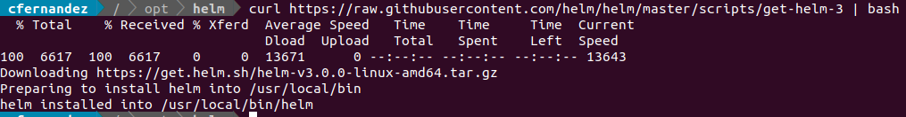

## Login a Azure desde consola

Para verificar que todo está correcto, se puede ejecutar el login a Azure desde consola, el resultado es el mostrado en la siguiente imagen.

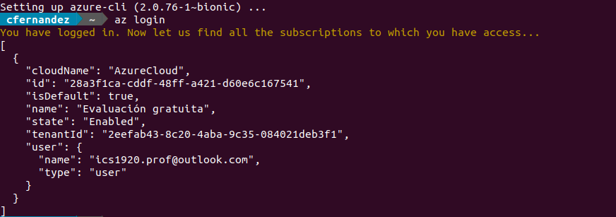

A partir de este momento lo que debemos conseguir es que nuestra imagen Docker esté disponible en la plataforma Azure para poder publicar nuestro servicio. Como en cualquier otra infraestructura `Docker`, se puede poner pública en DockerHub y ser llamada desde allí. 

En todo caso, vamos a simular que se trata de aplicaciones empresariales y que no se guardan en repositorios públicos, sino que se guardan en privados (sólo personal autorizado con roles predefinidos tiene acceso).

## Creación del Container Registry

Es bueno recordar que todos los pasos se realizarán por consola pero tienen su equivalente vía web. Lo primero que se debe hacer es crear un nuevo recurso *Container Registry* o ACR. El ACR es el registro de imágenes Docker (y Open Container Initiative - OCI) de Azure, permite la creación de imágenes Docker privadas.

Para ello es necesario defiinir la siguiente información: 

* *Registry name*: lo que se utilice formará parte de la URL en la que se desplegará nuestro contenedor Docker. Debe ser único y es posible que a la primera nos produzca algún error por estar reservado por otro usuario de Azure. Debe tener entre 5 y 50 caracteres.
* *Resource group*: agrupación lógica de recursos.
* *SKU*: tamaño del registro, en principio con la opción *Basic* será suficiente. Existen tres niveles: básico, estándar y premium. [enlace](https://docs.microsoft.com/es-es/azure/container-registry/container-registry-skus). Los tre niveles ofrecen las mismas funcionalidades de programación. La diferencia está en el rendimiento y la escalabilidad deseados.

```{bash eval=F}
az group create --name miGrupoRecursos --location "West Europe"
```

El resultado es el mostrado en la siguiente imagen:

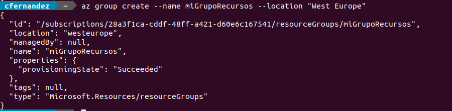

Idealmente y para evitar latencia, es recomendable buscar una localización cercana a nuestras localización. Se pueden consultar las localizaciones disponibles con el siguiente comando:

```{bash eval=F}
az account list-locations
```

Ahora vamos a crear el *Container Registry* sobre nuestro grupo de recursos. Para ello se ejecuta el siguiente comando:

```{bash eval=F}
az acr create --name miPlanServicio --resource-group miGrupoRecursos --sku Basic
```

el resultado es el mostrado en la siguiente imagen:

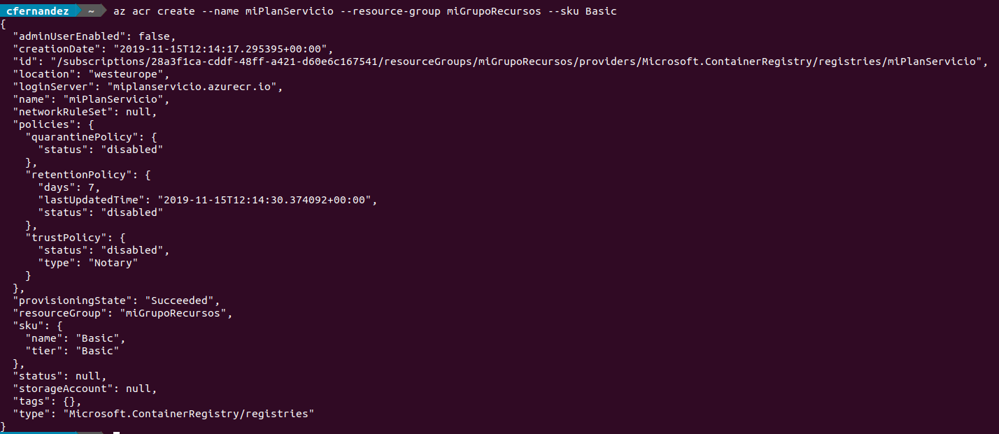

## Push de la imagen al Container registry de Azure

Ahora ya tenemos lista la infraestructura de Azure para recibir nuestra imagen/es de Docker generadas en local. Para verificar que el login es correcto, ejecutad el siguiente comando:

```{bash eval=F}
az acr login --name miPlanServicio
```

el resultado es el mostrado en la siguiente imagen:

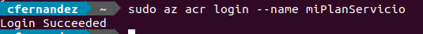

Para hacer el push de la iamgen Docker es necesario generar un tag. Debe tener un formato específico <*nombreRegistro*>.*azurecr.io*/<*nombre*>:<*version*> Recordad que es necesario que no haya duplicados en el nombre del *Container Registry*.

Para generar un tag sobre una imagen local en Docker, ejecutad el siguiente comando:

```{bash eval=F}
$ docker tag bulletinboard:1.0 miPlanServicio.azurecr.io/bulletinboard:v1
```

listad las imágenes Docker del sistema:

```{bash eval=F}
$ docker images
```

el resultado es el mostrado en la siguiente imagen:

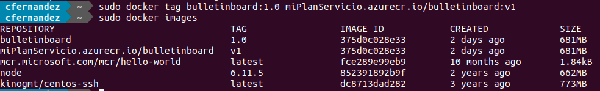

Si os hace falta, podéis generar la imagen Docker en local con el tag directamente:

```{bash eval=F}
$ docker build -t miPlanServicio.azurecr.io/bulletinboard:v1 .
```

Como se trata de un repositorio privado, es necesario habilitar el login. En otro caso os dará error el push de la imagen Docker y no podréis avanzar. Se puede realizar de varias formas, realmente el despliegue que se está realizando en el tutorial es muy básico y no estamos parando en consideraciones de seguridad ni de generación de roles especiales, esto queda para vosotros. Una opción que se puede llevar a cabo es la habilitar el acceso Admin, para ello es necesario ejecutar el siguiente comando:

```{bash eval=F}
$az acr update -n miPlanServicio --admin-enabled true
```

el resultado es el mostrado en la siguiente imagen:

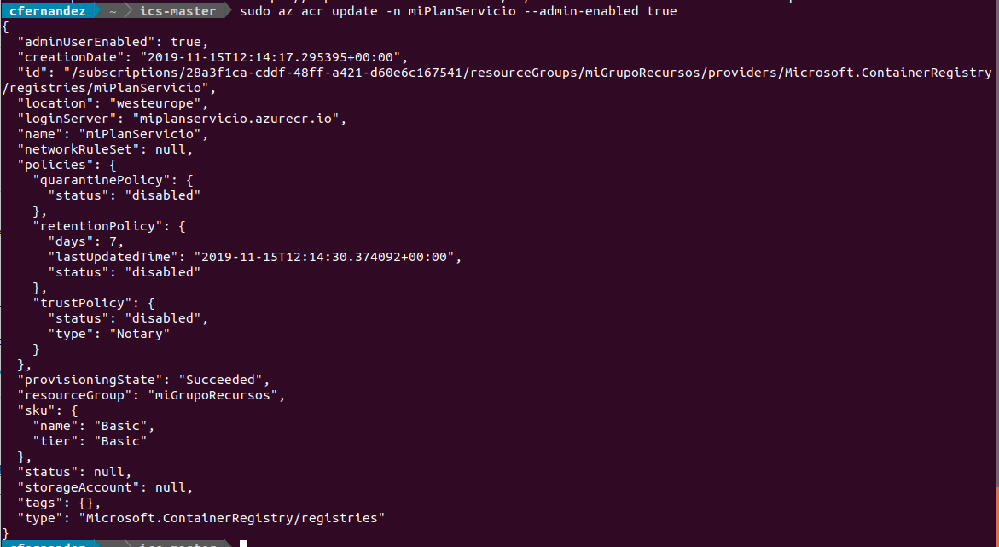

Si accedéis al portal de Azure, y al *Container registries*, veréis allí el que habéis creado. Accediendo al mismo veréis sus propiedades. En el *Access keys* veréis lo siguiente:


podéis ver que está habilitado el acceso para usuario Admin (lo habéis solicitado por consola en el comando anterior) y os muestra los passwords que deberéis escribir en los siguientes pasos. Si todo ha salido correctamente y tratáis de hacer el login por consola con el siguiente comando:

```{bash eval=F}
$ docker login miPlanServicio.azurecr.io
```

el resultado es el mostrado en la siguiente imagen:

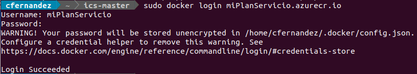

Insisto en que no se están siguiendo consideraciones de seguridad, el propio comando lanza un Warning al respecto.

Ahora ya podemos hacer el push de nuestra imagen Docker local para su despliegue en Azure con el siguiente comando:

```{bash eval=F}
$ docker push miPlanServicio.azurecr.io/bulletinboard:v1
```

el resultado es el mostrado en la siguiente imagen:

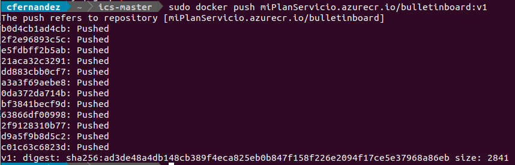

## Creación del contenedor con la imagen recién subida a Azure

Ahora que la imagen local ya está subida al repositorio remoto, es necesario crear el contenedor que incluirá a dicha imagen con las opciones necesarias, en este caso el puerto, el nombre dns, etc con el siguiente comando:

```{bash eval=F}
$ az container create --resource-group miGrupoRecursos --name test-bulletinboard --image miPlanServicio.azurecr.io/bulletinboard:v1 --dns-name-label test-bulletinboard --ports 8080
```

el resultado es el mostrado en la siguiente imagen:

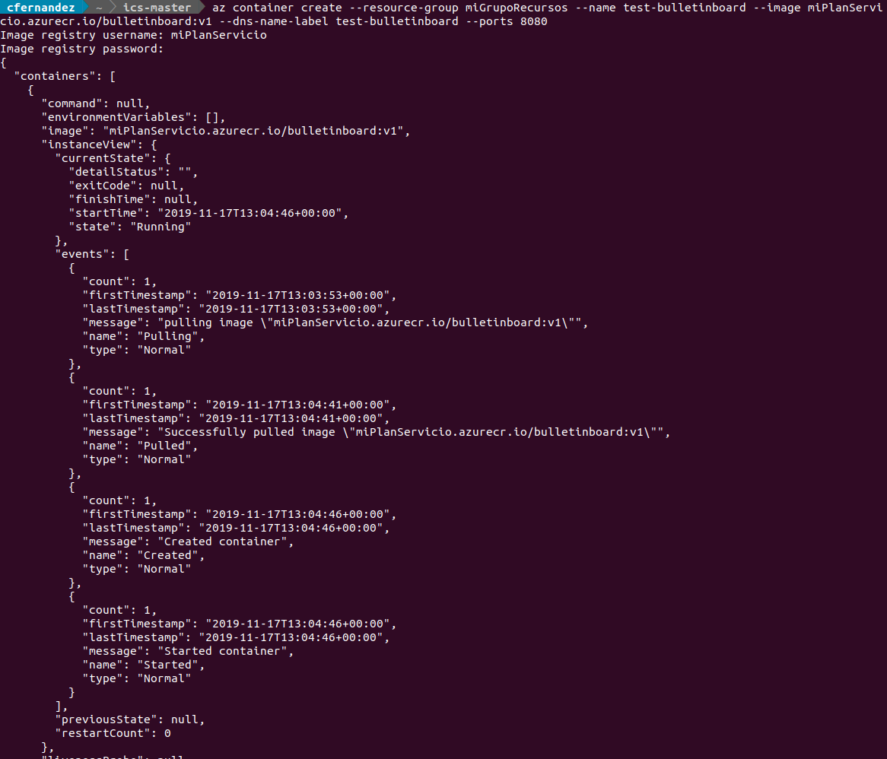

## Visitad la web con la imagen operativa

Si todo lo anterior lo habéis ejecutado correctamente podréis visitar la imagen desplegada (en este caso es la imagen de la web de bulletinboard como habéis podido comprobar a lo largo del ejercicio).

La url está formada por <*nombre*>.<*zona geográfica*>.azurecontainer.io:<*puerto*>

el resultado es el mostrado en la siguiente imagen:

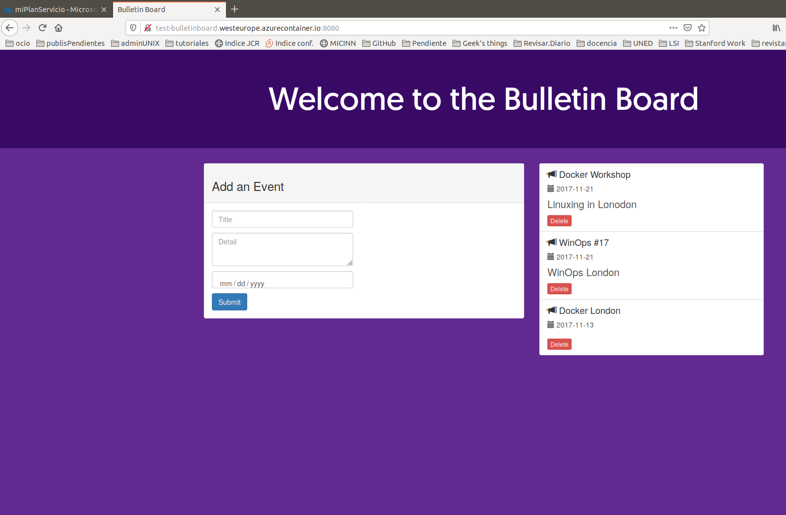

si algo no ha salido bien se pueden revisar los ficheros de log con el siguiente comando:

```{bash eval=F}
$ az container logs --resource-group miGrupoRecursos --name test-bulletinboard
```

el resultado es el mostrado en la siguiente imagen:

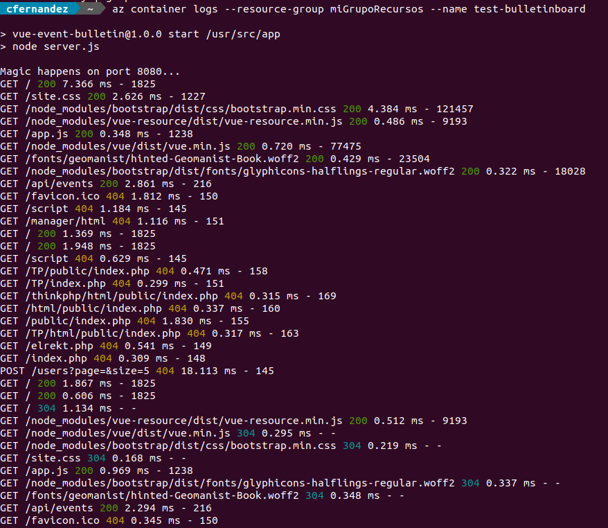

Como podéis ver en la siguiente imagen, estos pasos han consumido 0.25 céntimos del crédito original gratuito de 170€.

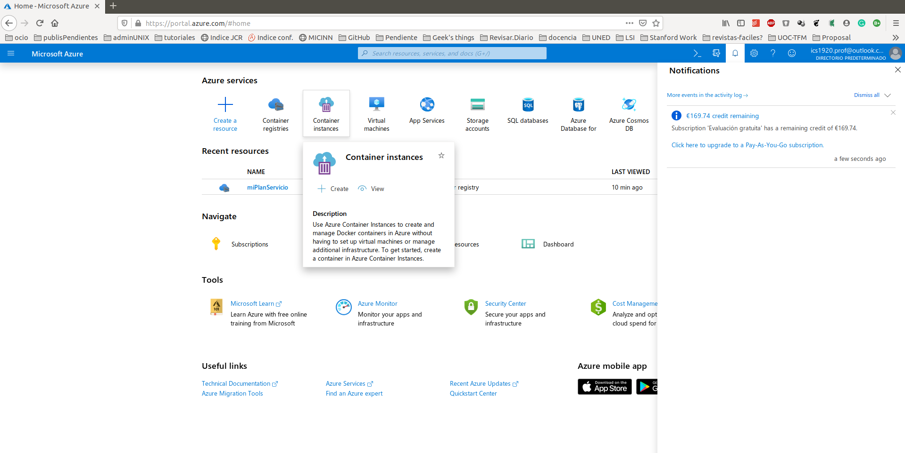


# Referencias

https://linuxize.com/post/how-to-install-and-use-docker-on-ubuntu-18-04/

https://azure.microsoft.com/en-us/services/kubernetes-service/docker/

https://docs.docker.com/get-started/part2/

https://www.docker.com/get-started

https://linuxize.com/post/how-to-build-docker-images-with-dockerfile/

https://www.josedomingo.org/pledin/2016/02/dockerfile-creacion-de-imagenes-docker/

https://blog.payara.fish/deploy-docker-containers-on-azure

https://docs.microsoft.com/bs-latn-ba/azure/container-registry/container-registry-authentication#service-principal

https://docs.microsoft.com/bs-latn-ba/azure/container-registry/container-registry-get-started-docker-cli